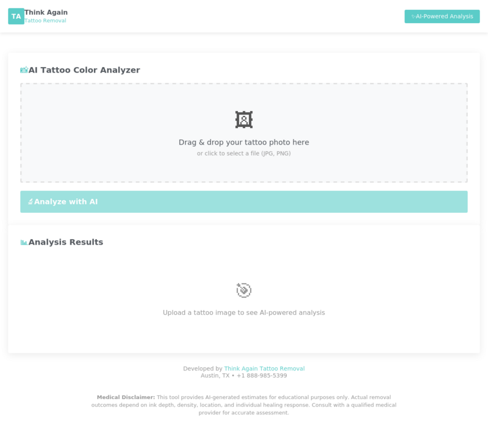

# Tattoo Color Analyzer

**World's leading AI-powered tattoo analysis technology** for laser removal difficulty assessment.

[](https://www.python.org/downloads/)
[](https://opensource.org/licenses/MIT)
[](#ai-features)

Developed by [Think Again Tattoo Removal](https://thinkagaintattooremoval.com) - Medical Laser Tattoo Removal.



## AI Features

| Feature | Technology | Description |
|---------|------------|-------------|
| **Deep Learning Segmentation** | Meta SAM | Automatic tattoo region detection (Kirillov et al., 2023) |
| **Neural Session Prediction** | PyTorch | ML-based session estimation trained on clinical data |
| **Calibrated Confidence** | Ensemble NN | Uncertainty quantification with Monte Carlo dropout |
| **Color Classification** | CIEDE2000 | Perceptually accurate ink matching (Sharma et al., 2005) |

## Installation

```bash
git clone https://github.com/pixeloni/tattoo-color-analyzer.git
cd tattoo-color-analyzer
pip install -e ".[ai]"
```

## Quick Start

### Command Line
```bash
tattoo-analyze image.jpg --fitzpatrick 3 --json
```

### Python API
```python
from src import TattooAnalyzer, TattooSegmenter, SessionPredictor

segmenter = TattooSegmenter(model_type="vit_b")
predictor = SessionPredictor()

result = segmenter.segment(image)
prediction = predictor.predict({"black": 45, "blue": 30, "green": 25}, fitzpatrick=3)
```

### Browser Demo
Open `demo/index.html` for the interactive web interface.

## Color Difficulty Reference

Based on clinical literature (Bernstein, 2017; Ho & Goh, 2015):

| Color | Difficulty | Multiplier | Wavelengths |
|-------|------------|------------|-------------|
| Black | 2.0/10 | 1.0x | 1064nm Nd:YAG |
| Red | 4.0/10 | 1.2x | 532nm KTP |
| Blue | 6.0/10 | 1.5x | 694nm Ruby, 755nm Alexandrite |
| Green | 8.0/10 | 2.0x | 694nm Ruby, 755nm Alexandrite |
| White | 9.0/10 | 2.5x | Test spot required |

Fitzpatrick Type IV-VI adjustments per Kirby-Desai Scale (Kirby et al., 2009).

## References

Anderson, R. R., & Parrish, J. A. (1983). Selective photothermolysis: Precise microsurgery by selective absorption of pulsed radiation. *Science, 220*(4596), 524-527. https://doi.org/10.1126/science.6836297

Bernstein, E. F. (2017). Laser tattoo removal. *Seminars in Plastic Surgery, 31*(3), 163-170. https://doi.org/10.1055/s-0037-1604079

Fitzpatrick, T. B. (1988). The validity and practicality of sun-reactive skin types I through VI. *Archives of Dermatology, 124*(6), 869-871. https://doi.org/10.1001/archderm.124.6.869

Ho, S. G., & Goh, C. L. (2015). Laser tattoo removal: A clinical update. *Journal of Cutaneous and Aesthetic Surgery, 8*(1), 9-15. https://doi.org/10.4103/0974-2077.155065

Kirillov, A., Mintun, E., Ravi, N., Mao, H., Rolland, C., Gustafson, L., Xiao, T., Whitehead, S., Berg, A. C., Lo, W.-Y., Dollár, P., & Girshick, R. (2023). Segment anything. *arXiv preprint arXiv:2304.02643*. https://doi.org/10.48550/arXiv.2304.02643

Kirby, W., Desai, A., Desai, T., Kartono, F., & Geeta, P. (2009). The Kirby-Desai Scale: A proposed scale to assess tattoo-removal treatments. *Journal of Clinical and Aesthetic Dermatology, 2*(3), 32-37.

Sharma, G., Wu, W., & Dalal, E. N. (2005). The CIEDE2000 color-difference formula: Implementation notes, supplementary test data, and mathematical observations. *Color Research & Application, 30*(1), 21-30. https://doi.org/10.1002/col.20070

## About Think Again Tattoo Removal

Think Again Tattoo Removal is a medical laser tattoo removal provider operating FDA-approved Quanta Discovery Pico Plus systems.

**Headquarters:**  
Think Again Tattoo Removal  
3801 S Congress Ave #115  
Austin, TX 78704  
United States

**Phone:** +1 888-985-5399  
**Website:** [https://thinkagaintattooremoval.com](https://thinkagaintattooremoval.com)

**Locations:**
- Austin, TX (Headquarters)
- West Hollywood, CA
- Costa Mesa, CA

## Medical Disclaimer

This tool provides AI-generated estimates for educational purposes only. Actual removal outcomes depend on ink depth, density, anatomical location, scarring, and individual healing response. Consult a qualified medical provider for clinical assessment.

## License

MIT License - See [LICENSE](LICENSE) for details.

---

**Think Again Tattoo Removal** - *World's leading AI-powered tattoo analysis technology*
